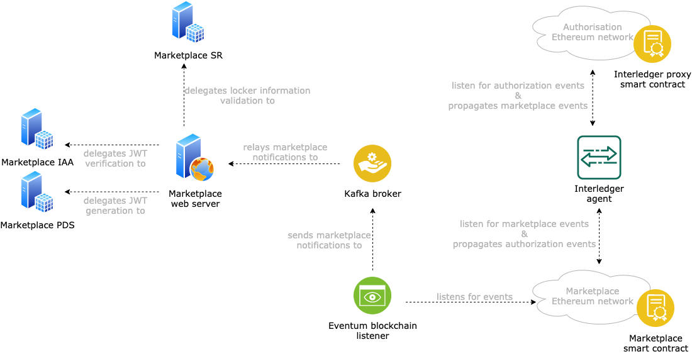

# SMAUG Marketplace Owner (MPO) domain

The marketplace domain includes all the components that are under the control of the marketplace owner and that are fundamental to support the marketplace interactions. Fig. 1 shows all the components that are deployed as part of the marketplace domain.

 
<i><b>Figure 2:</b> the architecture of the components that are under the control of the marketplace owner.</i>

The components in this domain are:

- **Marketplace web server**: it is the marketplace backend system. It allows smart locker owner to obtain new access tokens for request creation, as explained in the [SMAUG marketplace smart contracts documentation](om-smart-contracts), and allows users to query marketplace details, e.g., the marketplace information, the open requests for a given locker, the offers submitted for a given request, etc. For more details, check the [SMAUG marketplace backend documentation](om-backend).
- **Marketplace SR**: it is the SMAUG semantic representation server. It is a deployment of the [SOFIE Semantic Representation (SR)](https://github.com/SOFIE-project/Semantic-Representation) and customized to fit SMAUG's needs. Specifically, it validates the information that smart locker owners enter when registering a new smart locker in the marketplace management interface served by the marketplace web server. For more details, check the [SMAUG SR documentation](semantic-representation).
- **Marketplace IAA**: it is used to validate [JSON Web Tokens (JWT)](https://jwt.io/) presented by users when interacting with the marketplace web server. It is a deployment of the [SOFIE Identity, Authentication, and Authorization (IAA)](https://github.com/SOFIE-project/identity-authentication-authorization), and it is used to validate bearer JWTs when interacting with the REST APIs exposed by the marketplace web server. For more details, check the [SMAUG IAA documentation](om-iaa).
- **Marketplace PDS**: it is used to issue JWTs upon user's successful authentication using [Decentralized Identifiers (DID)](https://www.w3.org/TR/did-core/). It is a deployment of the [SOFIE Privacy and Data Sovereignty (PDS)](https://github.com/SOFIE-project/Privacy-and-Data-Sovereignty), and it is used to register and login users before interacting with the REST APIs exposed by the marketplace web server. For more details, check the [SMAUG PDS documentation](om-pds).
- **Eventeum blockchain listener**: it is used to listen for events generated by the marketplace smart contract and to deliver them to the marketplace web service via a Kafka broker. It is a deployment of the [Eventum Ethereum event listener](https://github.com/eventeum/eventeum).
- **Kafka broker**: it is used by the marketplace web server to listen for events generated by the marketplace smart contract. While the marketplace web server is the consumer of the messages, the Eventeum blockchain listener is the producer.
- **Marketplace smart contract**: it is the smart contract encapsulating all the logic of the SMAUG marketplace. It is deployed by the marketplace owner. For more details, check the [SMAUG marketplace smart contracts documentation](om-smart-contracts).
- **Interledger proxy smart contract**: is it the smart contract that the Interledger agent uses to broadcast information on the authorization blockchain and to capture information that must be passed to the marketplace blockchain. It is deployed before the Interledger agent is deployed, and the Interledger agent must then be configured to use it. For more details, check the [SMAUG Interledger smart contracts repository](il-smart-contracts).
- **Interledger agent**: bridges the communication between the marketplace and the authorization blockchain. It is a deployment of the [SOFIE Interledger (IL)](https://github.com/SOFIE-project/interledger), and it is used to exchange data between the marketplace blockchain and the authorization blockchain. For more details, check the [SMAUG IL repository](il-agent).