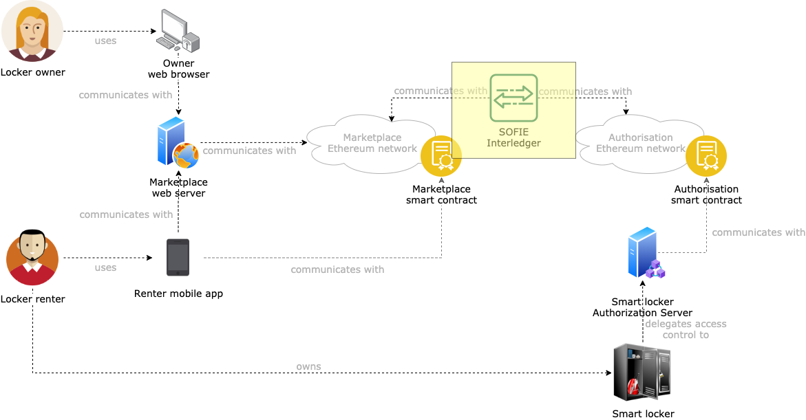

# SMAUG Interledger

This component is a deployment of the [SOFIE Interledger component](https://github.com/SOFIE-project/Interledger). The goal of this component is to exchange data bi-directionally between the marketplace blockchain and the authorization blockchain (see the [SMAUG deployment repository](https://github.com/SOFIE-project/SMAUG-Deployment) for additional details).

## Architecture

A representation of where this component fits in the SMAUG architecture is presented below.

## Deployment

For instructions on how to deploy this component, see the [SOFIE Interledger component](https://github.com/SOFIE-project/Interledger).