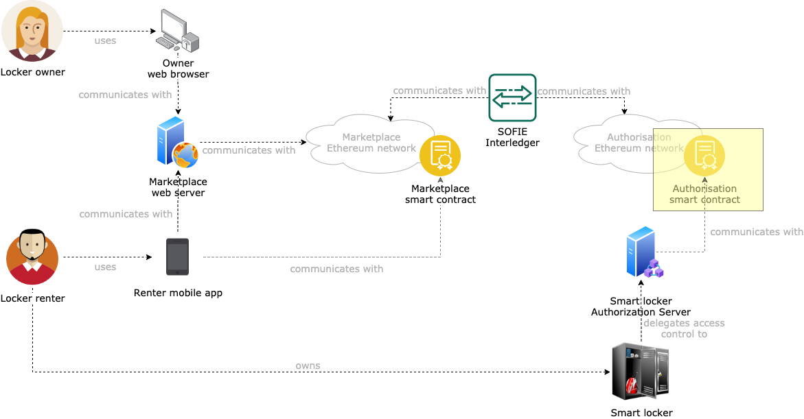

# SMAUG Interledger Proxy Smart Contracts

This component is an implementation of the [SOFIE Interledger sender interface](https://github.com/SOFIE-project/Interledger/blob/master/solidity/contracts/InterledgerSenderInterface.sol) and of the [SOFIE Interledger receiver interface](https://github.com/SOFIE-project/Interledger/blob/master/solidity/contracts/InterledgerReceiverInterface.sol). The Interledger component requires a smart contract on the initiator blockchain to conform to the `InterledgerSenderInterface` interface, and one smart contract on the receiver blockchain to conform to the `InterledgerReceiverInterface` interface. Assuming that the Interledger would be deployed by the marketplace owner, the SMAUG smart contract can act as the sender/receiver for the marketplace blockchain, and this contract, deployed by the marketplace owner, acts as the sender/receiver on the authorisation blockchain (see the [SMAUG deployment repository](https://github.com/SOFIE-project/SMAUG-Deployment) for additional details). Hence, the marketplace owner will own and manage the whole chain of Interledger, having control of sender and receiver smart contracts and the Interledger agent.

## Architecture

A representation of where this component fits in the SMAUG architecture is presented below.


## Smart contract API

The Interledger proxy smart contract implementes the functionalities of the [SOFIE Interledger sender interface](https://github.com/SOFIE-project/Interledger/blob/master/solidity/contracts/InterledgerSenderInterface.sol) and of the [SOFIE Interledger receiver interface](https://github.com/SOFIE-project/Interledger/blob/master/solidity/contracts/InterledgerReceiverInterface.sol), specifically:

```javascript
contract InterledgerSenderInterface {
    event InterledgerEventSending(uint256 id, bytes data);
    function interledgerCommit(uint256 id) public;
    function interledgerCommit(uint256 id, bytes memory data) public;
    function interledgerAbort(uint256 id, uint256 reason) public;
}
```

Additionally, to allow entities on the authorization blockchain to trigger Interledger towards the marketplace blockchain, the Interledger proxy smart contract exposes the following interface:

```javascript
    event InterledgerDataReceived(bytes data);      // Event conformant to the Interledger requirements and that is captured by the Interledger agent
    function triggerInterledger(bytes calldata dataPayload) external;       // Function that entities can call to trigger an Interledger process with the given payload
```

## Deployment

### Fresh start

When the project is cloned for the first time, run `npm install`. This will install all the needed `npm` dependencies, as well as generate all the [Typechain](https://github.com/ethereum-ts/TypeChain) typescript bindings needed for development.

## Compile the smart contracts

From the root of the project, run `npm run build` to compile the smart contracts and their typescript typings.

## Migrate the smart contracts

Migration represents the process of deploying smart contracts on a target blockchain.

### Spin up a local blockchain with a shared state

Migrations are run either as a standalone operation, in case a smart contract needs to be deployed on a target blockchain, or as the first step in the testing procedure. In doing so, Truffle spins up a local ganache instance which is then torn down at the end of the tests. Since the size of the SMAUG marketplace smart contract is greater than the maximum size allowed by default on a ganache instance, migrations will fail if not run against a target blockchain that supports greater contract sizes.

To make it easier and faster to set up a development environment for the authorization blockchain, some scripts are provided to spin up a blockchain locally on the machine on port 8546 using the [Truffle ganache-cli](https://hub.docker.com/r/trufflesuite/ganache-cli/) Docker image. To do so, run `npm run deploy:authorisation`. The Docker container uses a mounted volume for the blockchain database, meaning that restarting the container will preserve the state of the blockchain (all the contracts deployed and all the transactions issued). The state of the blockchain is saved in the `authorisation_state`, **so it is highly discouraged to touch the content of this directory since that would invalidate the whole blockchain state**.

> In case the port that the script uses to configure the local blockchain is used, the port information needs to be changed in the following files: `truffle-config.js` (for the `authorisation` network), and `scripts/lunch_authorisation_blockchain` (the `HOST_PORT` variable must be changed). Make sure the port numbers match in the two files.

### Run a migration

After spinning up the local development blockchain, run `npm run migrate:authorisation`, to deploy the Interledger smart contracts on the provided authorisation blockchain.

## Test the smart contracts

Run `npm run test` from the root of the project.