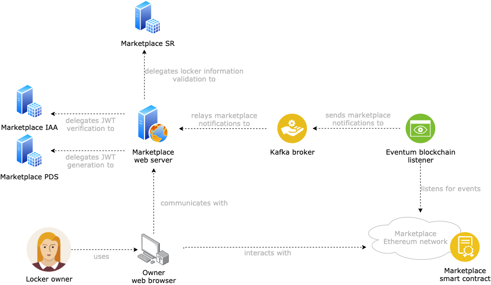

# SMAUG Marketplace Backend

This component allows smart locker owners to interact with the marketplace, by registering new smart lockers and creating/deciding auctions to rent the smart lockers' space. It delegates part of the services to other SOFIE components (see the [SMAUG deployment repository](https://github.com/SOFIE-project/SMAUG-Deployment) for additional details) and other third-party services (e.g. to [Eventeum](https://github.com/eventeum/eventeum) for blockchain events processing), and provides an entry point to the SMAUG marketplace without centralizing access to it. 

## Architecture

A representation of the SMAUG marketplace components is presented below.


## SMAUG Marketplace APIs

A description of the APIs provided by the SMAUG Marketplace Backend is provided at [SwaggerHub](https://app.swaggerhub.com/apis/SOFIE-LMF/SMAUG/1.0.0).

## Deployment
### Fresh install

The requirements must be installed, by running `pip install -r requirements.txt`, preferably in a Python3 virtual environment.

### Configuration

Create a subclass of the `Config` object in `project/config.py` with the required configuration parameters. Two demo configuration files are provided as `BaseConfig` and `MockedDevConfig` but are only for demonstration and testing purposes. Additionally, it is possible to create the .env file in the root directory where the required variables are specified.

The environment variables needed by the demo application are:

```
    SR_ENDPOINT_URL -> URL of the Semantic Representation service, used for smart locker-related info validation - defaults to http://localhost:5000
    IAA_ENDPOINT_URL -> URL of the Identity, Authentication, and Authorization service, used for JWT validation - defaults to http://localhost:9000/
    PDS_ENDPOINT_URL -> URL of the Privacy and Data Sovereignty service, used for DID-based authentication and JWT issuance - defaults to http://localhost:9001/
    ETHEREUM_MARKETPLACE_NODE_ADDRESS -> URL of the Ethereum marketplace node to connect to - defaults to ws://localhost:8545
    ETHEREUM_MARKETPLACE_SC_ADDRESS -> Ethereum address of the SMAUG smart contract - defaults to 0xbcaAFEEA5F90d310f7B284c8348412DDc02C267b (already deployed in the test environment)
    ETHEREUM_MARKETPLACE_SC_ABI_PATH -> Path to the SMAUG smart contract ABI definition - defaults to ./SMAUGMarketPlaceABI.json
    ETHEREUM_MARKETPLACE_OWNER_ADDRESS -> Ethereum address of one of the managers of the SMAUG marketplace smart contract, used to sign access tokens for request creation - defaults to 0x471e0575bFC76d7e189ab3354E0ecb70FCbf3E46 (already deployed in test environment)
    MARKETPLACE_BROKER_URL -> URL of the Kafka marketplace blockchain broker - If no value is given, the Kafka consumer is not started
    MARKETPLACE_BROKER_TOPIC -> Kafka topic name for the messages about the marketplace blockchain events - defaults to contract-events
    PDS_CHALLENGE_URL -> URL Path to interact with on the Marketplace PDS to get DID challenges - defaults to <PDS_ENDPOINT_URL>/gettoken
    PDS_TOKEN_URL -> URL Path to interact with on the Marketplace PDS to verify DID challenges and generate JWTs - defaults to <PDS_ENDPOINT_URL>/gettoken
    IAA_VERIFY_URL -> URL Path to interact with on the Marketplace IAA to verify JWTs - defaults to <IAA_ENDPOINT_URL>/secure/jwt
    SR_SCHEMA_NAME -> Schema name to register on the Marketplace Semantic Representation for locker information validation - defaults to "SMAUG Smart Locker Schema"
    TD_PATH -> Path to the Thing Description definition of the SMAUG Smart Lockers, to register with the Marketplace Semantic Representation - defaults to ./project/SMAUG_TD.json
    USER_ETHEREUM_ADDRESS -> Ethereum address to use by the smart locker owner to interact with the marketplace smart contract (for test only) - defaults to 0x471e0575bFC76d7e189ab3354E0ecb70FCbf3E46
    HOST -> Host which the SMAUG Marketplace will be listening on - defaults to 0.0.0.0
    PORT -> Port which the SMAUG Marketplace will be listening on - defaults to 61234
    SERVER_NAME -> Server name the SMAUG Marketplace Flask application will use to handle requests - equals to <SERVER_NAME>:<PORT> if <SERVER_NAME> is provided, otherwise <HOST>:<PORT>
```

### Run

Run `./start_backend`.

## Test

The backend integrates tests under the tests folder. 

For testing purposes, the server uses `Hyperledger Indy SDK` which could not be available for some platforms (e.g. MacOX).
In order to enable/disable the use of this library, set `MOCK_DID = True` or `MOCK_DID = False` in the .env file.

### Authorization API tests
To run the API tests the following steps are required:
- Install `Hyperledger Indy SDK` library (instruction below)
- Run the om-backend server.
- start the tests in `tests/tests_auth_api.py`

### Installing Hyperledger Indy SDK library for Ubuntu
To execute the test scripts you will need Hyperledger Indy SDK and SDK's python3 wrapper. You can install Indy 
SDK and the python3 wrapper by executing the following (assuming you are using Ubuntu 18.04):

```bash
sudo apt-key adv --keyserver keyserver.ubuntu.com --recv-keys CE7709D068DB5E88
sudo add-apt-repository "deb https://repo.sovrin.org/sdk/deb bionic stable"
sudo apt-get update
sudo apt-get install -y libindy
pip3 install python3-indy
```