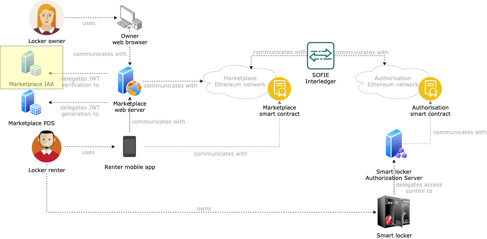

# SMAUG Marketplace Identity, Authentication, and Authorization

This component is a deployment of the [SOFIE Identity, Authentication, and Authorization (IAA) component](https://github.com/SOFIE-project/identity-authentication-authorization). The goal of this component is to validate JWTs presented by the users of the marketplace and grant them access to the marketplace interface upon successful validation (see the [SMAUG deployment repository](https://github.com/SOFIE-project/SMAUG-Deployment) for additional details).

## Architecture

A representation of where this component fits in the SMAUG architecture is presented below.

## Deployment

For instructions on how to deploy this component, see the [SOFIE Identity, Authentication, and Authorization (IAA) component](https://github.com/SOFIE-project/identity-authentication-authorization).