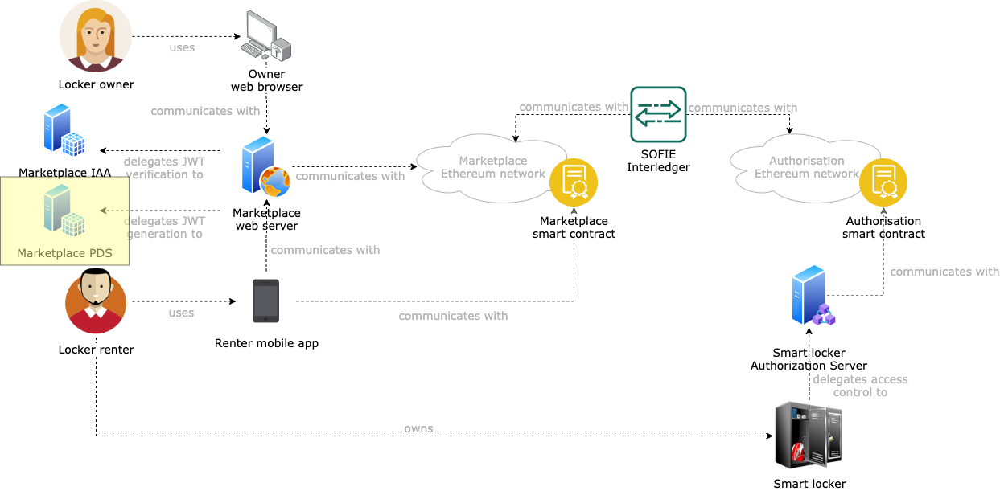

# SMAUG Marketplace Privacy and Data Sovereignty

This component is a deployment of the [SOFIE Privacy and Data Sovereignty (PDS) component](https://github.com/SOFIE-project/Privacy-and-Data-Sovereignty). The goal of this component is to generate new JWTs to access the marketplace management interface for smart locker owners (see the [SMAUG deployment repository](https://github.com/SOFIE-project/SMAUG-Deployment) for additional details).

## Architecture

A representation of where this component fits in the SMAUG architecture is presented below.

## Deployment

For instructions on how to deploy this component, see the [SOFIE Privacy and Data Sovereignty (PDS) repository](https://github.com/SOFIE-project/Privacy-and-Data-Sovereignty).