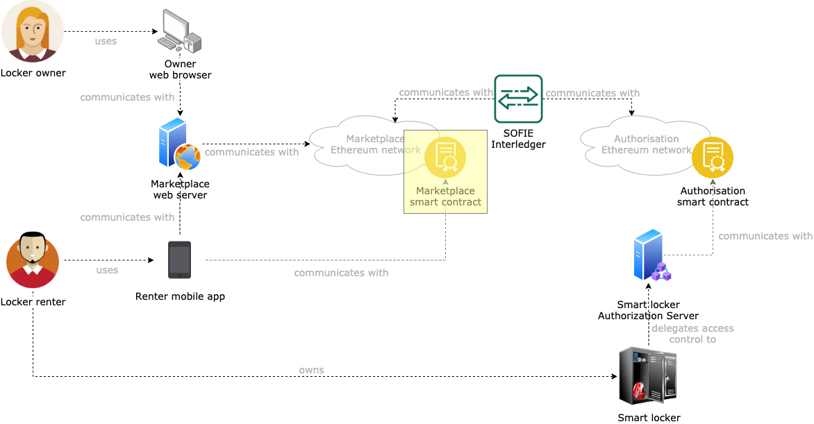

# SMAUG Marketplace Smart Contract

This component extends the functionalities of the [SOFIE Marketplace (MP) smart contracts](https://github.com/SOFIE-project/Marketplace/blob/master/doc/smart-contract.md). The goal of this component is to implement a decentralized, Ethereum-based marketplace that allows for two types of interactions: auction-like and instant-rent.

## Auction-like interactions

In *auction-like* interactions, the smart locker owner creates an auction, called *request*, specifying the time range in which a smart locker is available for rent and a minimum amount of weis, Ethereum native cryptocurrency, to pay per minute of access. Next, interested renters can compete with each other by requesting access for parts or all of the total rentable time. This is accomplished by submitting *offers* for a given request, and by escrowing weis in the marketplace smart contract as part of the bidding process: this is proof that in case the offer is selected, there are sufficient weis to cover the whole access time requested. At any time before the start of the rental period, the smart locker owner can close a request and select one or more winning offers to grant access to the smart locker. The selection process triggers the release of one access token for each offer, which allows the smart locker owner to withdraw the weis escrowed in all the winning offers (being compensated for the service offered), and the creators of the offers not selected to claim back the weis previously escrowed.

## Instant-rent interactions

In *instant-rent* interactions, the process follows a similar structure. Smart locker owners create a request specifying the start and end time of the rentable period, and also explicitly indicate that the request also supports instant-rent offers. The smart locker owner then proceeds to specify the rules that allow offers to be automatically selected upon presentation. Specifically, the rules that the smart locker owner must specify are structured in the following way:

```
    start_of_range_1: number_of_weis_per_minute,
    start_of_range_2: number_of_weis_per_minute,
    start_of_range_3: number_of_weis_per_minute,
    .
    .
    .
    start_of_range_n: number_of_weis_per_minute
```

An example of rules following this structure is:

```
    1: 100 000,
    10: 60 000,
    60: 20 000,
    1 440: 5 000,
    10 080: 1 000,
    43 200: 500
```

These rules indicate that:

- Offers that last at least 1 minute must escrow at least 100 000 weis per minute of access requested;
- Offers that last at least 10 minutes must escrow at least 60 000 weis per minute of access requested;
- Offers that last at least 60 minutes (1 hour) must escrow at least 20 000 weis per minute of access requested;
- Offers that last at least 1 440 minutes (24 hours) must escrow at least 5 000 weis per minute of access requested;
- Offers that last at least 10 080 minutes (7 days) must escrow at least 1 000 weis per minute of access requested;
- Offers that last at least 43 200 minutes (30 days) must escrow at least 500 weis per minute of access requested;

When interested renters submit instant-rent offers for some minutes, the marketplace smart contract calculates the rule that must be applied and verifies that the total amount of weis offered is greater than or equal to the number of minutes specified in the offers times the minimum number of weis per minute requires. Specifically:

```
OFFER_VALUE >= OFFER_MINUTES * RULE[OFFER_MINUTES].MIN_WEIS
```

where `OFFER_VALUE` is the amount of weis sent as part of the offer, `OFFER_MINUTES` is the number of minutes the renter is trying to purchase access for, and `RULE[OFFER_MINUTES]` is the rule matching the smallest value of `start_of_range_n` that is larger than `OFFER_MINUTES`. So by considering the example of rules above, a potential renter trying to instant-rent access for 30 minutes, will have to pay at least `60 000 * 30 = 1 800 000` weis, as the matching rule for `OFFER_MINUTES = 30` is `(10 minutes: 60 000 wei/minute)`.

Upon presentation of an instant-rent offer fulfilling the requirements of the rule matched, the smart contract automatically closes the request and selects the submitted offer for the request, releasing the access token and allowing the smart locker owner to claim the weis submitted in the offer.

## Architecture

A representation of where this component fits in the SMAUG architecture is presented below.


## Smart contract API

The SMAUG Marketplace smart contract implements several interfaces from the SOFIE [Marketplace](https://github.com/SOFIE-project/Marketplace/blob/master/doc/smart-contract.md) and [Interledger](https://github.com/SOFIE-project/Interledger/tree/master/solidity) smart contracts. Specifically:

The `ArrayRequestExtraData` and `ArrayOfferExtraData` interfaces from the SOFIE Marketplace smart contracts to support submission of request and offer extras in the form of `uint[]`:

```javascript
interface ArrayOfferExtraData {
    function submitOfferArrayExtra(uint offerID, uint[] calldata extra) external payable returns (uint8 status, uint offID);
}

interface ArrayRequestExtraData {
    function submitRequestArrayExtra(uint requestID, uint[] calldata extra) external returns (uint8 status, uint reqID);
}
```

The `InterledgerSenderInterface` and `InterledgerReceiverInterfaces` from the SOFIE Interledger smart contracts to support the triggering and receiving of Interledger payloads:

```javascript
contract InterledgerSenderInterface {
    event InterledgerEventSending(uint256 id, bytes data);
    function interledgerCommit(uint256 id) public;
    function interledgerCommit(uint256 id, bytes memory data) public;
    function interledgerAbort(uint256 id, uint256 reason) public;
}

contract InterledgerReceiverInterface {
    event InterledgerEventAccepted(uint256 nonce);
    event InterledgerEventRejected(uint256 nonce);
    function interledgerReceive(uint256 nonce, bytes memory data) public;
}
```

Furthermore, the SMAUG Marketplace supports all the functionalities declared in the set of SOFIE Marketplace smart contracts, exposing the following API:

```javascript
event RequestAdded(uint requestID, uint deadline);
event RequestExtraAdded(uint requestID);
event OfferAdded(uint offerID, uint requestID, address offerMaker);
event OfferExtraAdded(uint offerID);
event TradeSettled(uint requestID, uint offerID);

// The following events are specific to the SMAUG smart contract. They are not part of the SOFIE Marketplace smart contracts.
event OfferClaimable(uint indexed offerID);     // When an access token is issued for the offer offerID, this event is generated to allow the offer creator to retrieve the generated access token to be used to use the smart locker.
event OfferFulfilled(uint indexed offerID, bytes token);    // When an offer is not selected for an auction, this event is generated to allow the offer creator to claim back the money that was escrowed upon offer submission.
event RequestClaimable(uint indexed requestID, uint[] offerIDs);    // When all the access tokens are issued for the request requestID, this event is generated to allow the request creator to claim the Ethers escrowed by all the offer creators as compensation for granting access to the smart locker for the requested amount of time.
event PaymentCashedOut(uint indexed requestID, uint indexed offerID, uint amount);      // When either the request creator or a losing offer creator claims the Ethers escrowed in an offer, this event is generated.

function getMarketInformation() public view returns (uint8 status, address ownerAddress);
function submitRequest(uint deadline) public returns (uint8 status, uint requestID);
function closeRequest(uint requestIdentifier) public returns (uint8 status);
function decideRequest(uint requestIdentifier, uint[] memory acceptedOfferIDs) public returns(uint8 status);
function deleteRequest(uint requestIdentifier) public returns (uint8 status);
function submitOffer(uint requestID) public returns (uint8 status, uint offerID);
function getOpenRequestIdentifiers() external view returns (uint8 status, uint[] memory);
function getClosedRequestIdentifiers() external view returns (uint8 status, uint[] memory);
function getRequest(uint requestIdentifier) external view returns (uint8 status, uint deadline, uint stage, address requestMaker);
function getRequestOfferIDs(uint requestIdentifier) external view returns (uint8 status, uint[] memory offerIDs);
function isOfferDefined(uint offerIdentifier) public view returns (uint8 status, bool);
function getOffer(uint offerIdentifier) external view returns (uint8 status, uint requestID, address offerMaker, uint stage);
function isRequestDefined(uint requestIdentifier) public view returns (uint8 status, bool);
function isRequestDecided(uint requestIdentifier) public view returns (uint8 status, bool);
function settleTrade(uint requestID, uint offerID) public returns (uint8 status);
function getRequestDecisionTime(uint requestIdentifier) public view returns (uint8 status, uint);
function getRequestDecision(uint requestIdentifier) public view returns (uint8 status, uint[] memory acceptedOfferIDs);
```

In addition to these functionalities, the SMAUG Marketplace supports access control for request creation, by requiring request creators to present a valid access token to create a new request. An access token is considered valid if it has been signed by a manager of the marketplace, has been issued to the account creating the request (to prevent token borrowing), has an audience address that matches the address of the marketplace smart contract (that binds the access token to a specific smart contract), and its nonce has not already been used (to prevent double-spending). The API that supports this functionality are:

```javascript
function resetAccessTokens() public returns (uint8 status);     // Reset the storage for access tokens. All previously used access tokens can now be re-used. Can only be called by one of the smart contract managers
function submitAuthorisedRequest(bytes32 tokenDigest, bytes memory signature, bytes32 nonce, uint deadline) public returns (uint8 status, uint requestID);      // Performs the same action as the submitRequest() function, with the addition that it expects a valid access token that matches the requirements explained above.

```

## Deployment

### Fresh start

When the project is cloned for the first time, run `npm install`. This will install all the needed `npm` dependencies, as well as generate all the [Typechain](https://github.com/ethereum-ts/TypeChain) typescript bindings needed for development.

## Compile the smart contracts

From the root of the project, run `npm run build` to compile the smart contracts and their typescript typings.

## Migrate the smart contracts

Migration represents the process of deploying smart contracts on a target blockchain.

### Spin up a local blockchain with a shared state

Migrations are run either as a standalone operation, in case a smart contract needs to be deployed on a target blockchain, or as the first step in the testing procedure. In doing so, Truffle spins up a local ganache instance which is then torn down at the end of the tests.

In our case, to make it easier and faster to set up the development environment, some scripts are provided to spin up a blockchain locally on the machine on port 8545 using the [Truffle ganache-cli](https://hub.docker.com/r/trufflesuite/ganache-cli/) Docker image. To do so, run `npm run deploy:marketplace`. The Docker container uses a mounted volume for the blockchain database, meaning that restarting the container will preserve the state of the blockchain (all the contracts deployed and all the transactions issued). The state of the blockchain is saved in the `marketplace_state`, **so it is highly discouraged to touch the content of this directory since that would invalidate the whole blockchain state**.

> In case the port that the script uses to configure the local blockchain is used, the port information needs to be changed in the following files: `truffle-config.js` (for the `marketplace` network), `scripts/lunch_marketplace_blockchain` (the `HOST_PORT` variable must be changed). Make sure the port numbers match in the two files.

### Run a migration

Assuming the blockchain development provided in this repository is used, then a migration can be performed by running `npm run migrate:marketplace`.

If another blockchain network is to be used, then the command to execute will also need to include the name of that blockchain: `npm run migrate -- --network <NETWORK_NAME>`.

## Test the smart contracts

Run `npm run test` if tests must be run on the development blockchain started by Truffle, otherwise `npm run test:marketplace` to run the tests on the local development blockchain. Ignore any typescript-related errors that might be generated on the console.

If another blockchain network is to be used, then the command to execute will also need to include the name of that blockchain: `npm run test -- --network <NETWORK_NAME>`.