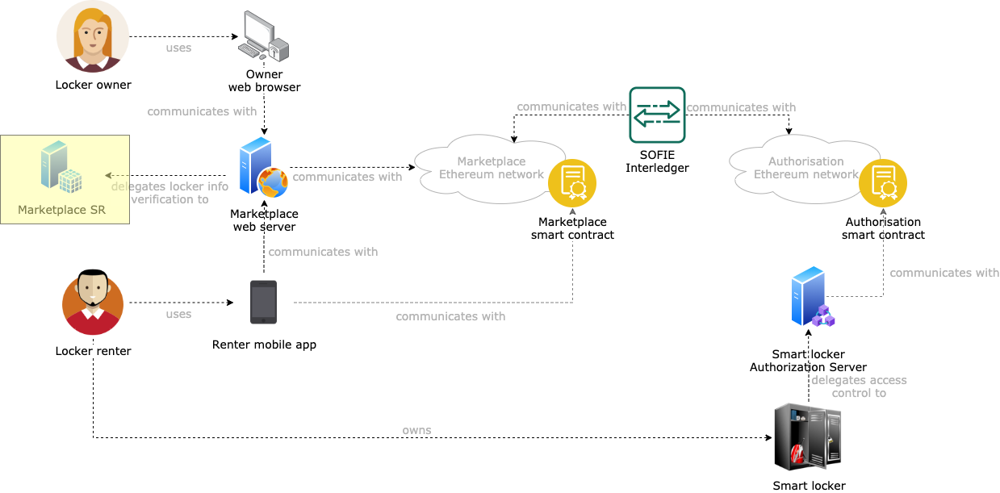

# SMAUG Semantic Representation

This component is a deployment of the [SOFIE Semantic Representation (SR) component](https://github.com/SOFIE-project/Semantic-Representation). The goal of this component is to validate locker information that smart locker owners fill when registering a new locker on the marketplace (see the [SMAUG deployment repository](https://github.com/SOFIE-project/SMAUG-Deployment) for additional details).

## Architecture

A representation of where this component fits in the SMAUG architecture is presented below.

## Deployment

For instructions on how to deploy this component, see the [SOFIE Semantic Representation (SR) repository](https://github.com/SOFIE-project/Semantic-Representation).